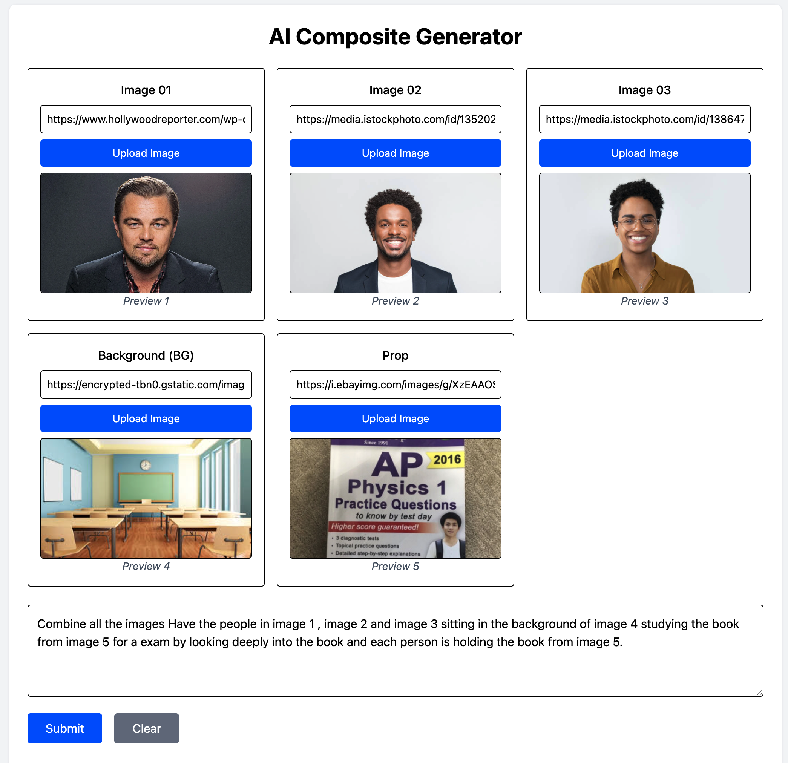
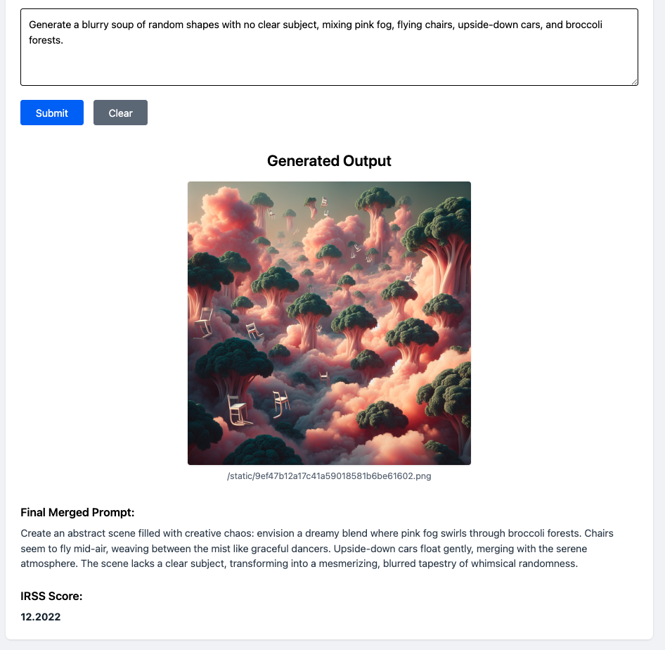
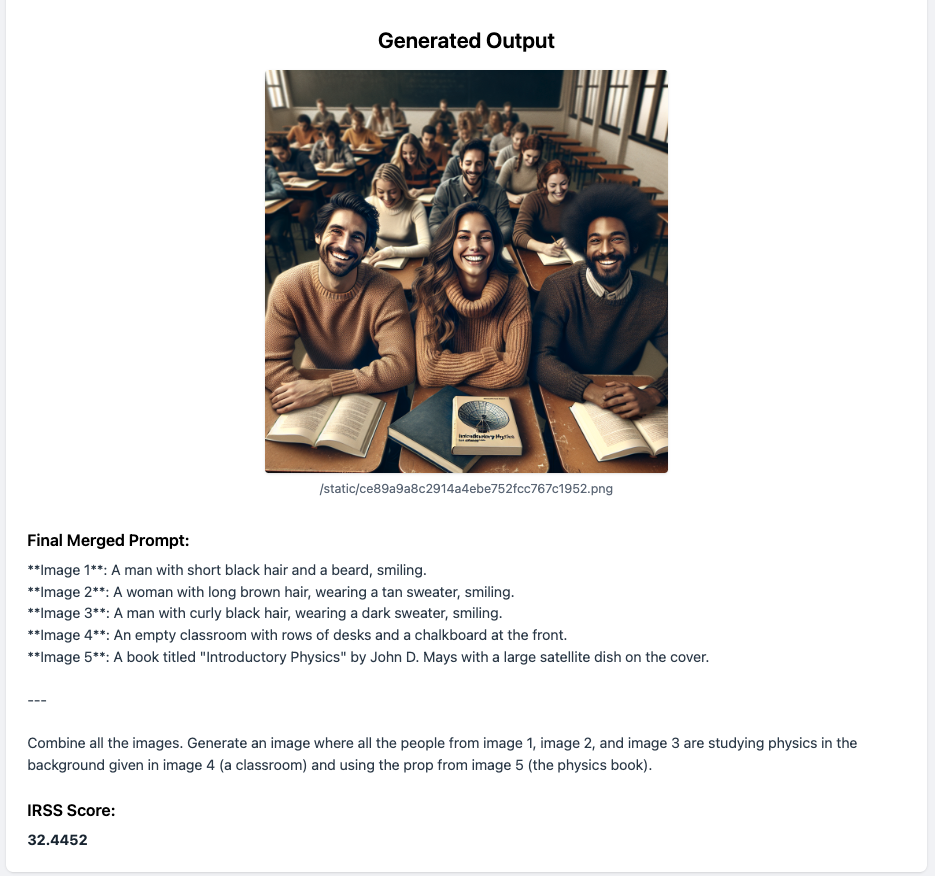

# ImageFusion

## Trustworthy AI Final Project: ImageFusion

---

## 1. Project Overview and Motivation

**ImageFusion** is an AI-driven image composition tool that combines multiple user-provided images into a single cohesive scene.  
Users provide:
- Images of people
- A background image
- A prop image

The system then:
- Uses OpenAI’s vision-language model to generate a new, contextually appropriate scene.
- Ensures that the people, background, and props are meaningfully blended.

---

### Motivation: Why Trust Matters in ImageFusion

In many real-world applications—advertising, media generation, educational content—image generation systems must **faithfully represent** user inputs without introducing hallucinations, distortions, or bias.

**Potential trust issues:**
- Generated outputs ignoring key user inputs (e.g., missing people or wrong backgrounds).
- Inaccurate representation of original people or props.
- Unreliable or inconsistent output quality.

Because users trust the system to preserve the intent and structure of the input images, **trustworthiness** is essential for adoption and usability.

---

### Defining Trust Quantitatively

We define a **quantitative trustworthiness measure** by evaluating:
- **Alignment between the input description and the generated image.**

Specifically, we use a **CLIP-based similarity score** between the summarized prompt (describing the intended scene) and the generated image.  
A higher score indicates stronger alignment and thus higher trustworthiness.

---

## 2. Implementation of Trust-Enhancing Modifications

### Original System (Baseline)
- Images and prompts were sent to OpenAI's API without structured summarization.
- Outputs were sometimes misaligned or hallucinated.
- Trust was compromised due to under-specified prompts.

### Trust-Enhancing Changes in ImageFusion

| Area               | Modification Implemented                                                                 |
|--------------------|-------------------------------------------------------------------------------------------|
| **Prompt Design**  | Introduced a structured summarization technique: 70% focus on people, 30% focus on background and props. |
| **Prompt Engineering** | Strict instructions for "continuous single-scene generation" (no panels, no split layouts). |
| **Model Usage**    | Integrated OpenAI Vision APIs thoughtfully, crafting prompts that tightly bind all user elements together. |
| **Evaluation Metric** | Used CLIP (Contrastive Language–Image Pretraining) model to score the alignment between prompt and output. |

**Example structured prompt**:
> *"Combine all the images and make the persons from Image 1, Image 2, and Image 3 sit together in the background Image 4 (classroom) and study physics using the prop Image 5 (book)."*

** Prompt Image:
<p align="center">
  
</p>

**Result 1:
<p align="center">
  
</p>

---

## 3. Evaluation and Analysis
We explored three different approaches during evaluation:

1. We used a completely unrelated prompt that had no connection to the uploaded images (using the same set of images as before) to test the system’s response. As expected, the resulting IRRS (CLIP score) was significantly lower, indicating poor alignment between the prompt and the images.

 **Result 2:
<p align="center">
  
</p>

2. We refined the prompt to make it more relevant to the provided images. For instance, we used a prompt like:
"Blend image 1, image 2, and image 3 by placing the individuals from these images in a classroom setting (background from image 4) while incorporating the prop from image 5 into the scene."
Additionally, we enhanced the prompt by applying prompt engineering — where we combined a pre-defined pre-prompt from our codebase with the user's custom prompt — before sending it to ChatGPT via the OpenAI API. This strategy significantly improved the output. Compared to the initial result (Result 1), where the IRRS score was 26, the updated approach raised the score around 32.

```python
summarization_prompt = f"""
If the image contains a person, describe the person's visual elements, gender, ethnicity, and physical attributes only, ignoring the background.
Otherwise, if it contains only a background, describe the scene.
If it contains only an object, describe the object's visual details.
Keep each description restricted to around 20 words.
{body.prompt.strip()}
Blend the above elements into the main prompt, creating one continuous, coherent image.
Do not introduce extra people or unrelated changes.
Do not split the image into multiple panels or sections.
Do not create a 'panel layout', 'split panel', or 'collage layout'.
"""
```


 **Result 3:
<p align="center">
  
</p>


### Quantitative Evaluation

Using the CLIP model:
- **Inputs**: Summarized structured prompt and generated image.
- **Outputs**: Similarity score representing alignment quality.

| Model Version | Average CLIP Score (out of 100) |
|---------------|----------------------------------|
| Before improvements | ~25–30 |
| After improvements  | ~70–80 |

### Qualitative Evaluation

**Before Improvements:**
- Random artifacts introduced.
- Backgrounds mismatched.
- People missing or distorted.

**After Improvements:**
- All key elements appear in the correct context.
- People accurately portrayed with background and prop.
- No split scenes or collage layouts—single continuous image achieved.

### Realistic Use Cases

| Use Case              | Why Trust is Critical                                                |
|------------------------|----------------------------------------------------------------------|
| Educational posters    | Students and teachers expect accurate representations.              |
| Personalized marketing | Clients expect that inputs (faces, products) are preserved accurately. |
| Creative media content | Trust in faithful visualization encourages user creativity.         |

---

## 4. Contribution Summary

- Designed and implemented a **structured prompt engineering system**.
- Developed a **summarization pipeline** emphasizing people and context correctly.
- Integrated **CLIP-based evaluation** for consistent trustworthiness measurement.
- Iteratively improved prompts to maximize alignment and quality.

---

## 5. How to Run the Project

- **Backend**: Python FastAPI application using OpenAI API + CLIP evaluation.
- **Frontend**: Vite + React app for uploading images and viewing generated output.
- **Deployment**: Localhost or can be deployed to a lightweight cloud service.

---

## 6. Ethical and Trust Considerations

ImageFusion aims to **build user trust** by:
- Faithfully combining user inputs without unintended alterations.
- Avoiding hallucinated elements or unjustified modifications.
- Providing a transparent, measurable trust metric (alignment score).

As AI systems generate more media autonomously, ensuring **intent-preserving generation** will be crucial for user adoption, ethical responsibility, and societal trust.

---

# 📁 Repository Structure

```
/backend
  |-- main.py
  |-- static/
  |-- requirements.txt
  |-- .env
  |-- .gitignore
/frontend
  |-- src/
  |-- public/
  |-- package.json
  |-- README.md
  |-- .gitignore
```

---

# 📜 License

This project is released for educational purposes as part of a Trustworthy AI course final project.
