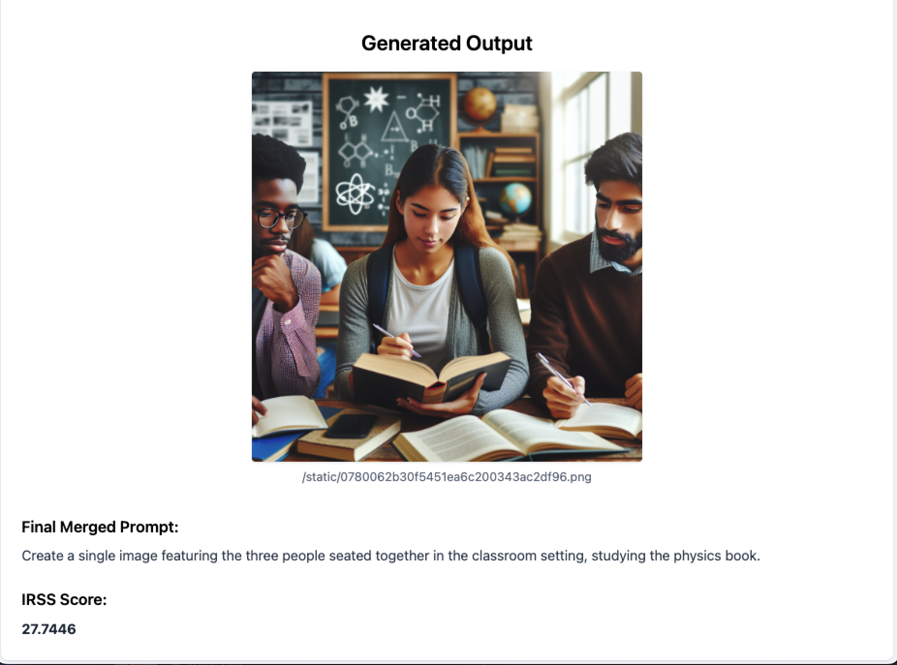

# ImageFusion

## Trustworthy AI Final Project: ImageFusion

---

## 1. Project Overview and Motivation

**ImageFusion** is an AI-driven image composition tool that combines multiple user-provided images into a single cohesive scene.  
Users provide:
- Images of people
- A background image
- A prop image

The system then:
- Uses OpenAI’s vision-language model to generate a new, contextually appropriate scene.
- Ensures that the people, background, and props are meaningfully blended.

---

### Motivation: Why Trust Matters in ImageFusion

In many real-world applications—advertising, media generation, educational content—image generation systems must **faithfully represent** user inputs without introducing hallucinations, distortions, or bias.

**Potential trust issues:**
- Generated outputs ignoring key user inputs (e.g., missing people or wrong backgrounds).
- Inaccurate representation of original people or props.
- Unreliable or inconsistent output quality.

Because users trust the system to preserve the intent and structure of the input images, **trustworthiness** is essential for adoption and usability.

---

### Defining Trust Quantitatively
We establish a quantitative measure of trustworthiness by assessing:

- The degree to which the generated image semantically corresponds with both the input prompt and the provided images.
To evaluate this alignment, we utilize a CLIP-based similarity score, which compares the summarized prompt (describing the intended scene) with the generated image.
A higher score indicates stronger semantic alignment, suggesting greater trustworthiness of the output.
This metric, commonly referred to as the CLIP similarity score or Image-Text Relevance Retrieval Score (IRRS), measures how closely the generated image matches the provided text description.

---

## 2. Implementation of Trust-Enhancing Modifications

### Original System (Baseline)
- Images and prompts were sent to OpenAI's API without structured summarization.
- Outputs were sometimes misaligned or hallucinated.
- Trust was compromised due to under-specified prompts.

### Trust-Enhancing Changes in ImageFusion

| Area               | Modification Implemented                                                                 |
|--------------------|-------------------------------------------------------------------------------------------|
| **Prompt Design**  | Introduced a structured summarization technique: 70% focus on people, 30% focus on background and props. |
| **Prompt Engineering** | Strict instructions for "continuous single-scene generation" (no panels, no split layouts). |
| **Model Usage**    | Integrated OpenAI Vision APIs thoughtfully, crafting prompts that tightly bind all user elements together. |
| **Evaluation Metric** | Used CLIP (Contrastive Language–Image Pretraining) model to score the alignment between prompt and output. |

**Example structured prompt**:
> *"Combine all the images and make the persons from Image 1, Image 2, and Image 3 sit together in the background Image 4 (classroom) and study physics using the prop Image 5 (book)."*

** Prompt Image (This reference image will be used for all the prompts showcased in the results below):
<p align="center">
  
</p>

**Result 1:
<p align="center">
  
</p>

---

## 3. Evaluation and Analysis
We explored three different approaches during evaluation:

- We used a completely unrelated prompt that had no connection to the uploaded images (using the same set of images as before) to test the system’s response. As expected, the resulting IRRS (CLIP score) was significantly lower, indicating poor alignment between the prompt and the images.

 **Result 2:
<p align="center">
  
</p>

- We refined the prompt to make it more relevant to the provided images. For instance, we used a prompt like:
"Blend image 1, image 2, and image 3 by placing the individuals from these images in a classroom setting (background from image 4) while incorporating the prop from image 5 into the scene."
Additionally, we enhanced the prompt by applying prompt engineering — where we combined a pre-defined system prompt from our codebase with the user's custom prompt (using {body.prompt.strip()})  — before sending it to ChatGPT via the OpenAI API. This strategy significantly improved the output. Compared to the initial result (Result 1), where the IRRS score was 26, the updated approach raised the score around 32.

```python
summarization_prompt = f"""
If the image contains a person, describe the person's visual elements, gender, ethnicity, and physical attributes only, ignoring the background.
Otherwise, if it contains only a background, describe the scene.
If it contains only an object, describe the object's visual details.
Keep each description restricted to around 20 words.
{body.prompt.strip()}
Blend the above elements into the main prompt, creating one continuous, coherent image.
Do not introduce extra people or unrelated changes.
Do not split the image into multiple panels or sections.
Do not create a 'panel layout', 'split panel', or 'collage layout'.
"""
```
 **Result 3:
<p align="center">
  
</p>

- With a more refined and carefully structured system prompt, the overall prompt quality significantly improved, leading to an even higher IRRS score. We were able to achieve an IRRS score of approximately 39, showcasing a substantial improvement in semantic alignment and image relevance. This indicates that thoughtful prompt engineering plays a critical role in enhancing the final output quality and model performance when generating images based on multi-image instructions.
```python
summarization_prompt = (
    "For each image: "
    "If it contains a person,you have to mention the ethnicity or skin tone, then describe the person's visible characteristics (e.g., hair color, gender, ethnicity) in about 30 words, ignoring the background. "
    "If it contains only a background, describe the scene. "
    "If it contains only an object, describe the object's visual details. "
    "Do not infer or imagine missing details. Only describe what is explicitly visible."

    "Then, combine the descriptions of all images into the following user instruction for the prompt: "
    f"\"{body.prompt.strip()}\" "
    "Create a summarized prompt that will be used as input to DALL-E 3, so prioritize clarity, key details, and visual faithfulness."
    "The combined prompt must create a single continuous scene, not separate sections. "
        )
prompt=merged_prompt + "Strictly avoid introducing extra characters, unrelated objects, or changing the original elements.Depict all individuals together naturally, interacting in the same scene, avoiding separate frames or isolated" "placement.Capture the scene in highly detailed photorealistic style, with natural human features, realistic lighting, and cinematic atmosphere, as if taken by a professional camera. "
```
**Result 4:
<p align="center">
  
</p>

### Quantitative Evaluation

Using the CLIP model:
- **Inputs**: Summarized structured prompt and generated image.
- **Outputs**: Similarity score representing alignment quality.

| Model Version | Average CLIP Score (out of 100) |
|---------------|----------------------------------|
| Before improvements | ~10–25 |
| After improvements  | ~25–40 |

The average CLIP similarity score across multiple attempts with different prompts was approximately 35.

### Qualitative Evaluation

**Before Improvements:**
- Random artifacts introduced.
- Backgrounds mismatched.
- People missing or distorted.

**After Improvements:**
- All key elements appear in the correct context.
- People accurately portrayed with background and prop.
- No split scenes or collage layouts—single continuous image achieved.

### Realistic Use Cases

| Use Case              | Why Trust is Critical                                                |
|------------------------|----------------------------------------------------------------------|
| Educational posters    | Students and teachers expect accurate representations.              |
| Personalized marketing | Clients expect that inputs (faces, products) are preserved accurately. |
| Creative media content | Trust in faithful visualization encourages user creativity.         |

---

## 4. Summary
In this project, ImageFusion, we explored the trustworthiness of AI in the context of image generation by combining multiple input images (people, backgrounds, and props) into a unified, coherent output using OpenAI's API. We designed a pipeline where user-uploaded images were processed, and a prompt describing the intended scene was generated and refined. This final prompt, after undergoing prompt engineering enhancements, was then used to guide the AI in generating the output image.

To evaluate how trustworthy and accurate the AI-generated images were relative to user intent, we used the CLIP-based similarity score. This score measures how well the generated image matches the summarized description prompt, with a higher score indicating stronger alignment and thus higher trustworthiness.

We evaluated the results using a CLIP-based similarity score, which measures how closely the generated image aligns with the intended prompt. Our findings showed:

- Unclear prompts led to low alignment scores and poor-quality outputs.

- Detailed user prompts significantly improved generation quality.

- Prompt engineering further enhanced trustworthiness, increasing the average CLIP score from 26 to around 35–39.

Conclusion
Our results emphasize that trust in AI-generated content heavily depends on prompt quality and engineering. Clear, structured instructions enable AI models to produce outputs that better reflect user intent.
Through ImageFusion, we demonstrate that trustworthy AI generation is achievable when combining strong prompt strategies with user input, supporting the broader goal of building responsible AI systems.

---

## 5. Ethical and Trust Considerations

ImageFusion aims to **build user trust** by:
- Faithfully combining user inputs without unintended alterations.
- Avoiding hallucinated elements or unjustified modifications.
- Providing a transparent, measurable trust metric (alignment score).

As AI systems generate more media autonomously, ensuring **intent-preserving generation** will be crucial for user adoption, ethical responsibility, and societal trust.

---

# 📜 License

This project is released for educational purposes as part of a Trustworthy AI course final project.

# Contribution 
This project was developed collaboratively by Pooja Srinivasan, Balaji Senthilkumar, and Parithosh Dharmapalan.
